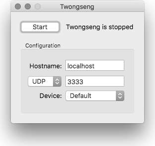

Twongseng
========

Twongseng is a [TUIO2](http://tuio.org) multitouch tracker for Mac OS X touchpad devices. 
This application allows to use the internal trackpad (or alternatively an external magic trackpad or magic mouse) 
to send /tuio2/ptr messages to your TUIO2 enabled multitouch application. It also allows alternative TUIO2/TCP and 
TUIO2/WEB transport methods in addition to the default TUIO2/UDP transport.

Usage
-----

1. Download [the application package](https://github.com/mkalten/twongseng/releases/download/0.1/Twongseng-0.1.zip)  
   (Universal i386/x86_64 binary, minimum MacOS X version 10.6)
2. Open it
3. Run Twongseng
    
    
    
4. optionally change the TUIO2/UDP port and host  
   or select alternative TUIO2/TCP or TUIO2/WEB transport
5. optionally select an internal or external trackpad
6. Click the Start button to activate Twongseng

Then ...

1. Run your TUIO2-based multitouch application
2. Start touching your touchpad

Compilation
-----------

### GUI Application

1. Retrieve the code. Using git

        $ git clone git://github.com/fajran/twongseng.git
    
    or by clicking [the download
	button](http://github.com/fajran/twongseng/tarball/master).

2. Open `TwongsengApp/TwongsengApp.xcodeproj` with Xcode.
3. Build the project.

### Command line application

1. Retrieve the code
2. Go to the source directory
3. Type `make` and return.

### Acknowledgements

This application is based on the original [Tongseng](https://github.com/fajran/tongseng) by Fajran Iman Rusadi.

